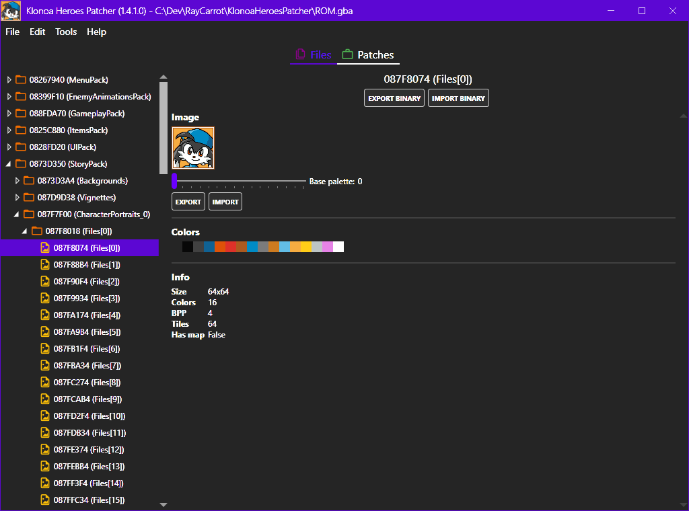
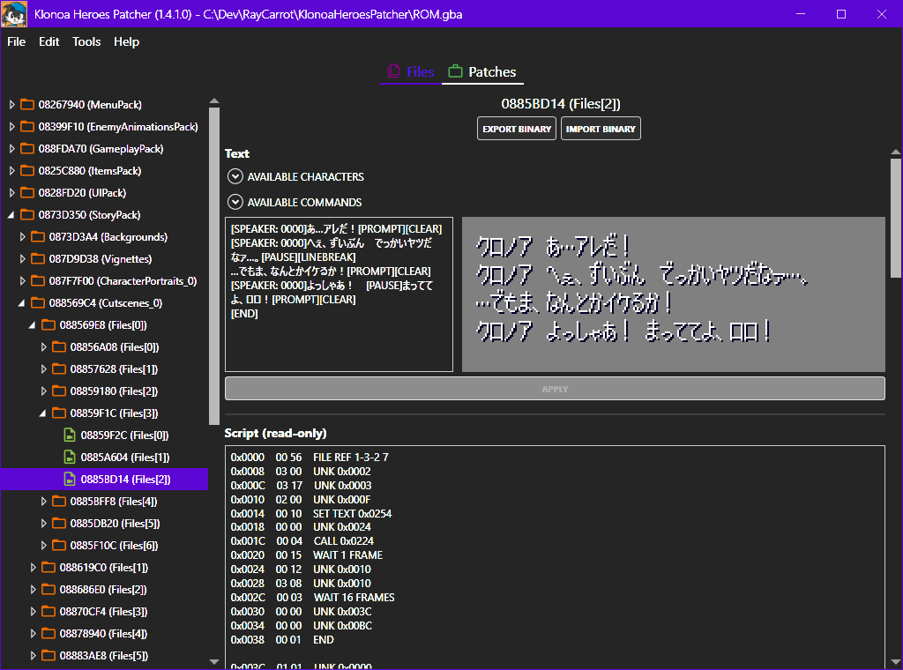

# Klonoa Heroes Patcher
Klonoa Heroes Patcher is a tool for replacing graphics, text and other data in the game, primarily made to allow translations of the game.

## How does it work?
Klonoa Heroes stores most of its data in archives of data blocks. This data gets parsed using [BinarySerializer.Klonoa](https://github.com/BinarySerializer/BinarySerializer.Klonoa) and displayed in the tool as a folder/file hierarchy. Saving after modifying a file will add the modified file data to the end of the ROM and update the offset to point to it. An additional footer is applied to the ROM where the modified data is referenced, along with its original position.

## Editors
Selecting a file will allow it to be edited in the panel to the right of the navigation panel. Any file can be modified by exporting and then importing the binary data. Supported file formats also have additional options.

### Graphics
Graphics files can be exported and imported to/from PNG and JPEG files. The exported file will be in either 4 or 8 BPP (bits per pixel). Importing the file can be in either 4, 8, 24 or 32 BPP. When importing an image file the image will be replaced to match that, using the closest matching colors from the selected base palette. If a tile map is used then a new one will be generated.

There are certain limitations to importing an image. For example if the original is 4-bit and uses multiple palettes then importing a new version of it will only use a single palette, thus limiting the number of colors. Slightly more tiles may also be created if a tile map is used due to it not reusing flipped or palette swapped tiles.

Currently the palette can't be modified without importing a binary version of the file data.

### Cutscenes/Text
Both cutscene and text files contain text which the game renders. The cutscenes contain an additional cutscene script. This script is currently read-only and is not fully parsed. Editing it requires importing a binary version of the file data.

Editing the text data can be done by modifying the contents of the text box and then pressing apply. This will show a message if the text was not formatted correctly and update the preview. The characters written in the text box get matched with a font table. This can be manually modified in the config file if one is generated (Tools > Generate config). The index in the font table corresponds to the index of the character in the font (Font_0 in the UI pack).

Multiple commands are available in the text, such as linebreaks and text clears.

