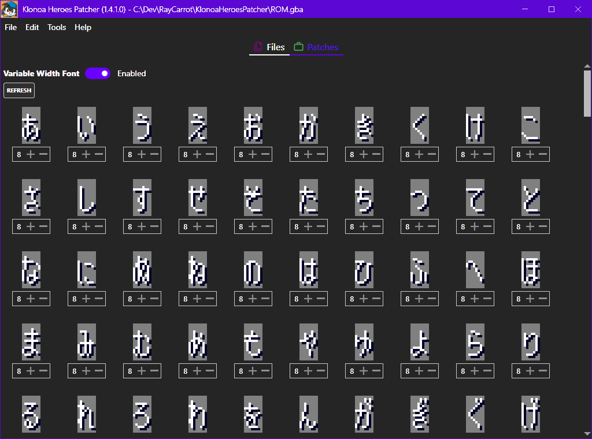

# Klonoa Heroes Patcher
Klonoa Heroes Patcher is a tool for replacing graphics, text and other data in the game, primarily made to allow translations of the game.

## How does it work?
Klonoa Heroes stores most of its data in archives of data blocks. This data gets parsed using [BinarySerializer.Klonoa](https://github.com/BinarySerializer/BinarySerializer.Klonoa) and displayed in the tool as a folder/file hierarchy. Saving after modifying a file will add the modified file data to the end of the ROM and update the offset to point to it. An additional footer is applied to the ROM where the modified data is referenced, along with its original position.

## Editors
Selecting a file will allow it to be edited in the panel to the right of the navigation panel. Any file can be modified by exporting and then importing the binary data. Supported file formats also have additional options.

### Graphics
Graphics files can be exported and imported to/from PNG and JPEG files. The exported file will be in either 4 or 8 BPP (bits per pixel). Importing the file can be in either 4, 8, 24 or 32 BPP. When importing an image file the image will be replaced to match that, using the closest matching colors from the selected base palette. If a tile map is used then a new one will be generated.

There are certain limitations to importing an image. For example if the original is 4-bit and uses multiple palettes then importing a new version of it will only use a single palette, thus limiting the number of colors.

For graphics files with a tile map this will be displayed with options to modify the properties for each individual tile.

Currently the palette can't be modified without importing a binary version of the file data.

### Cutscenes/Text
Both cutscene and various text file formats contain text which the game renders. The cutscenes contain an additional cutscene script. This script is currently read-only, visualized as text.

Editing the text data can be done by modifying the contents of the text box and then pressing apply. This will show a message if the text was not formatted correctly, allowing it to be corrected. The text preview will also update to reflect the new changes.

The characters written in the text box get matched with a font table. This can be manually modified in the config file if one is generated (Tools > Generate config). The index in the font table corresponds to the index of the character in the font. The text preview uses the first font in the UI Pack, but the game has multiple ones it uses for different texts, all with the same layout.

Multiple commands are available in the text, such as linebreaks and text clears. Commands are always written inside of brackets, such as `[CLEAR]`. In order to reference a font character not specified in the font table the index can be used directly like this `[0x0050]` where the value, in hex, represents the index.

### Animations
Animation files contain multiple animations, where each animation can have 8 variants (one for each direction it can face). These animations all share the same tile data and palettes. Currently animations can't be edited, but they can be viewed and exported.

### Items
Items files contain the item definitions. This includes the text, such as the name, and any additional values, such as the price.

## Patches
The Patches tab shows the available patches which can be enabled. These will modify different parts of the ROM and can all be reverted.

### Variable Width Font
The Variable Width Font patch allows each font character to have a specific width rather than the default 8 pixels. This does not effect the actual width of the image sprite rendered on screen, which is why it can't be greater than 8, but rather the space until the next character is drawn on screen. This will only work if the text is drawn to the screen using sprites, which it always is in cutscenes. In other places however it will usually be drawn through tile maps in which case the width can't be modified.

